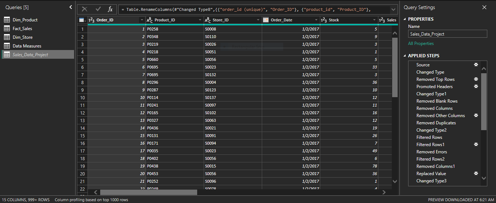
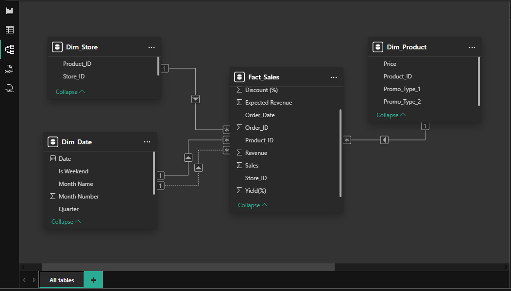

# 📊 Sales Performance & Revenue Analysis
## 📌Project Overview.
This project demonstrates the design and implementation of an end-to-end data pipeline and analytics dashboard using Power BI and Power Query.                The solution transforms raw sales data into a structured data model and delivers actionable insights through interactive visualizations. It simulates a real-world business scenario where data is cleaned, modeled and analyzed to support decision-making

---
## Objectives
- Build a reusable data pipeline (ETL process)
- Clean and transform raw sales data
- Design a structured data model (Fact & Dimension tables)
- Analyze sales, product performance and promotions
- Develop an interactive dashboard for business insights
---
## 🛠 Tools & Technologies 
- Power BI
- Power Query (ETL & Data Transformation)
- Excel (Data Source)
- SQL (Foundational knowledge for data querying)
---
## 🔄 Data Pipeline Workflow 
**Extract** — Raw sales data imported from CSV files

**Transform** — Data cleaned using Power Query:
- Removed duplicates and inconsistencies
- Handled missing values
- Standardized formats
- Created calculated metrics: Expected Revenue, Discount %, Yield %

**Load** — Cleaned data loaded into Power BI

**Modeling** — Designed a **Star Schema**:
- Fact Table: Sales transactions
- Dimension Tables: Product, Store, Date

**Visualization** — Built dashboard for reporting and insights

**Automation** — Implemented refresh-based workflow to simulate a data pipeline

---
## 📊 Dashboard Features 
**KPI Metrics**:
 - Total Units Sold
 - Total Revenue Generated
 - Average Yield (%)
 - Average Delivery Time

**Visualizations**:
 - Sales & Revenue Trend Over Time
 - Top Performing Products by Revenue & Sales
 - Product Performance (Revenue vs Yield)
 - Impact of Promotion Type on Sales & Revenue
 - Delivery Performance Over Time
---
## 📸 Dashboard Preview 
### Dashboard Overview 

### Data Transformation (Power Query)

### Data Model

---
## 📊 Key Insights 
### Over all Performance 
- Total of **7,930 units sold**, generating **$29.18k revenue**
- Average yield of **16.4%** and delivery time of **2.52days**, indicating stable operations.
---
### Product Performance 
- **PO316** generated the highest revenue despite low sales volume — high-value product
- **PO103** achieved the highest sales volume and strong revenue — high-demand product
- Majority of products have low yield, with only a few driving strong performance.
  
👉 Insight: Revenue is driven by a mix of **high-volume and high-value products**

---
### Promotion Impact 
- **PR14 dominates performance**, contributing the majority of revenue and sales
- Other promotions have minimal impact on

👉 Insights: Heavy reliance on a single promotion creates **risk and opportunity for diversification**

---
### Sales Trends 
- Peak performance observed in **October**
- Lowest revenue in **January**, lowest sales volume in **June**
  
👉 Insights: Clear **Seasonal patterns** exist in sales performance

---
### Delivery Performance 
- Delivery time remains stable between **2.50 — 2.55 days**
- Slight increase observed in Q4
  
👉 Insights: Operations are **efficient and consistent**

---
### Revenue vs Yield Analysis 
- Most products fall below the **30% yield threshold**
- High Performers
 - PO103 (83.9% Yield)
 - PO316 (66.7% Yield)

👉 Insights: A small number of products drive drive **disproportionate value**

---
## 🧠 Key Learnings 
- Built a complete **ETL data pipeline workflow**
- Applied **data modeling (star schema)** for analytics
- Developed skills in **data cleaning, transformation, and visualization**
- Gained understanding of **business-driven data analysis**
- Learned how to turn raw data into **actionable insights**
---
## 🚀 Project Outcome 
This project demonstrates Practical skills in:
- Data Analysis
- Data Modeling
- Data Pipeline Design
- Business Intelligence Reporting
  
It showcases the ability to transform raw data into meaningful insights that support decision-making.

---
## 📁 Files Included 
- Power BI Dashboard (.pbix)
- Sample dataset
---
## Contact 
Feel free to connect with me on LinkedIn http://www.linkindin.com/in/precious-duruwandu 
or reach out for collaboration and opportunities.
